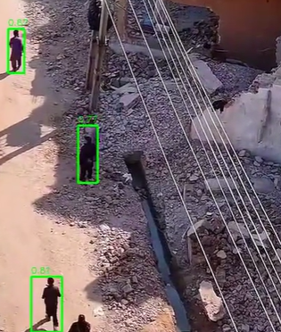

# 🚁 Drone SAR Detection System

A real-time Search & Rescue (SAR) detection system for drone footage, built with a coarse-to-fine dual-model pipeline to detect people in disaster scenarios — including crowds, low-visibility conditions, and high-altitude aerial views.

---

## 🎬 Demo



---

## 🎯 What It Does

- Detects people in drone footage using a **two-stage inference pipeline**
- Generates **automated alerts** for danger zones, stationary persons, and crowd clusters
- Provides a **Streamlit dashboard** to preview results and process custom videos
- Supports both **local video files** and **live drone streams** (RTSP/UDP)

---

## 🧠 Pipeline Architecture

```
Every Frame → YOLOv8n (fast, lightweight)
                    ↓
         Person detected OR every 30 frames
                    ↓
         YOLOv8x + SAHI (accurate, deep scan)
                    ↓
         Decision Engine (alerts: danger zone, stationary, cluster)
```

### Why coarse-to-fine?
At drone altitude, people appear as small as 10–30px. A single model at standard resolution misses many detections. The pipeline runs a fast model every frame for real-time speed, and triggers the full SAHI deep scan only when needed — achieving both accuracy and performance.

---

## ⚡ Model Comparison

| Model | Speed | Use Case |
|---|---|---|
| YOLOv8n (fast pass) | ~30 FPS | Every frame, catches obvious detections |
| YOLOv8x + SAHI (deep scan) | ~3–5 FPS | Triggered scan, catches small/occluded people |
| **Coarse-to-Fine Pipeline** | **~15–25 FPS** | **Best of both — real-time + accurate** |

---

## 🔍 Detection Features

- **Danger Zone Alert** — flags any person entering a defined high-risk region
- **Stationary Person Alert** — detects individuals who haven't moved in 10+ seconds (potential injury indicator)
- **Crowd Cluster Alert** — detects groups of 3+ people in close proximity
- **Temporal Memory** — carries forward detections across frames to handle momentary occlusion
- **CLAHE Enhancement** — improves contrast for shadow/low-light aerial footage

---

## 🖥️ Streamlit Dashboard

- **Left panel** — pre-processed demo SAR footage with detection overlays
- **Right panel** — upload any MP4, run the full pipeline, view results inline
- Alert summary with critical/warning breakdown
- Downloadable processed video and CSV alert log

---

## 🗂️ Project Structure

```
drone-sar-system/
├── main.py          # Main pipeline — video file or live stream
├── app.py           # Streamlit dashboard
├── vision_utils.py  # SAHI inference, NMS, frame enhancement, danger zone
├── decisions.py     # Alert logic — danger zone, stationary, cluster
├── benchmark.py     # Model benchmarking script
└── requirements.txt
```

---

## 🚀 Setup & Run

### 1. Install dependencies
```bash
pip install -r requirements.txt
```

### 2. Download YOLOv8 weights
Weights are auto-downloaded on first run into `Yolo-Weights/`. Or manually:
```bash
# YOLOv8n (fast model)
wget https://github.com/ultralytics/assets/releases/download/v0.0.0/yolov8n.pt -P Yolo-Weights/

# YOLOv8x (deep model)
wget https://github.com/ultralytics/assets/releases/download/v0.0.0/yolov8x.pt -P Yolo-Weights/
```

### 3. Add your video
Place your drone footage at `data/test_video.mp4`

### 4. Run detection
```bash
# Process a video file
python main.py

# Live drone stream
python main.py rtsp://192.168.1.1:554/live
```

### 5. Launch dashboard
```bash
streamlit run app.py
```

---

## 📊 Benchmark

Run model comparison across YOLOv8n, YOLOv8x+SAHI, and the coarse-to-fine pipeline:
```bash
python benchmark.py
```

---

## 🛠️ Tech Stack

- **YOLOv8** (Ultralytics) — object detection
- **SAHI** — sliced inference for small object detection
- **OpenCV** — video I/O, frame processing, HUD rendering
- **PyTorch** — CUDA GPU acceleration
- **Streamlit** — web dashboard
- **ffmpeg** — H.264 re-encoding for browser playback

---

## 📋 Requirements

- Python 3.9+
- NVIDIA GPU with CUDA (recommended — RTX 4050 or better)
- ffmpeg installed and on PATH